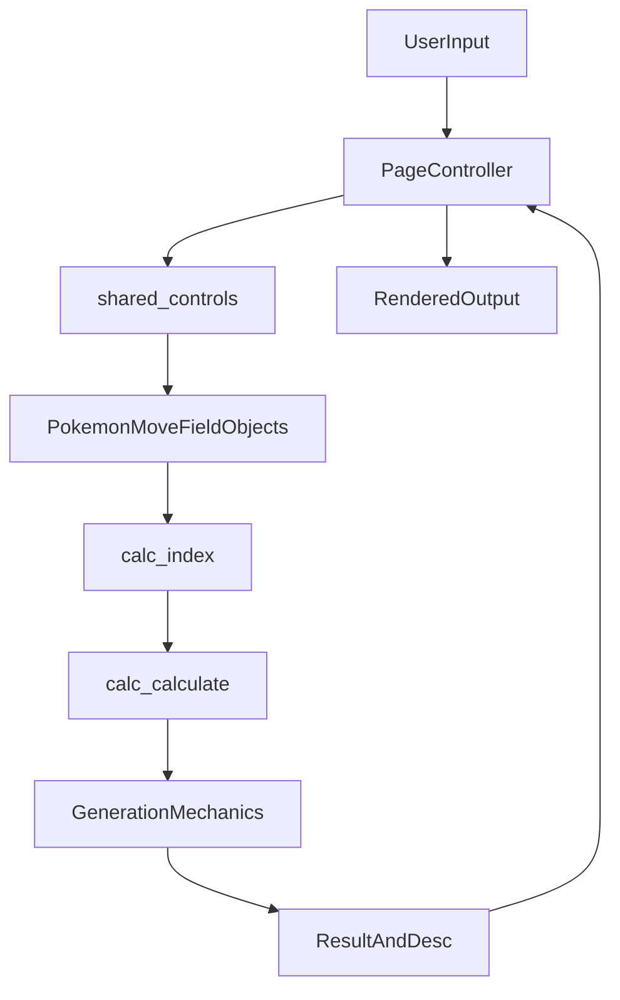

# Architecture Overview

## Purpose

This document explains how the repository is organized and how page level code connects to the shared damage engine.

## High Level Structure

- Root HTML pages provide separate calculator experiences.
- `src/js/` contains shared and mode specific browser controllers.
- `src/calc/` contains battle models, generation mechanics, and data catalogs.
- `css/` and `img/` provide static assets.

## Entry Points

- `src/index.html`
- `src/randoms.html`
- `src/oms.html`
- `src/raidalculate.html`
- `src/honkalculate.html`

Each page includes a controller script that binds events, collects user input, calls the engine, and renders output.

## Controller Mapping

- `src/index.html` and `src/randoms.html` use `src/js/index_randoms_controls.js` with `src/js/shared_controls.js`.
- `src/oms.html` uses `src/js/oms_controls.js` with shared helpers.
- `src/raidalculate.html` uses `src/js/raidalculate_controls.js` with shared helpers.
- `src/honkalculate.html` uses `src/js/honkalculate_controls.js` with shared helpers.

## Engine Boundary

UI controllers call `calc.calculate(gen, attacker, defender, move, field)` and pass model objects assembled from form data.

The engine routes by generation number through `src/calc/calc.js`:

- Gen 1-2: `src/calc/mechanics/gen12.js`
- Gen 3: `src/calc/mechanics/gen3.js`
- Gen 4: `src/calc/mechanics/gen4.js`
- Gen 5-6: `src/calc/mechanics/gen56.js`
- Gen 7-9: `src/calc/mechanics/gen789.js`

## Data Flow

## Common Change Paths

- Add or adjust move or ability behavior: edit the appropriate file in `src/calc/mechanics/` and verify related utility helpers in `src/calc/mechanics/util.js`.
- Add a new UI option: update `src/js/shared_controls.js` if option is common, then update the relevant mode controller for rendering.
- Add data entries: update the right catalog in `src/calc/data/` and any dependent UI data in `src/js/data/`.
