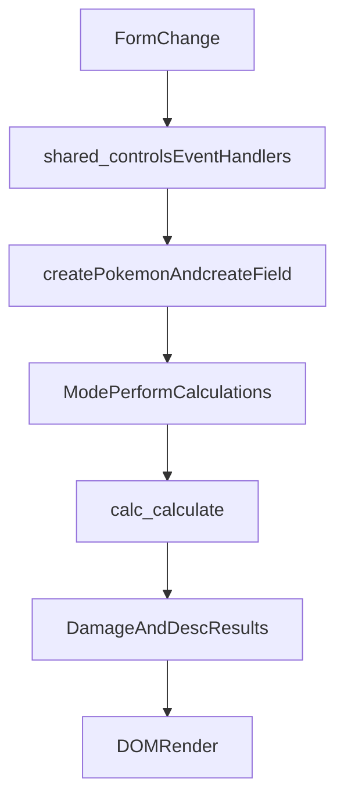

# UI Flow Deep Dive

## Purpose

This document maps browser side flow from user input to calculation output and explains where mode behavior diverges.

## Shared Layer

Primary shared file: `src/js/shared_controls.js`

Key responsibilities:

- Input validation and stat boundary clamping.
- HP and stat recalculation when form values change.
- Generation aware stat mapping for legacy formats.
- Form serialization into engine objects through:
  - `createPokemon(pokeInfo)`
  - `createField()`
- Move extraction and normalization before calculation calls.

Shared controls are the adapter between DOM form state and engine model classes.

## Standard and Randoms Flow

Controller: `src/js/index_randoms_controls.js`

Flow:

1. Read left and right side form state.
2. Build model objects for both sides.
3. Call `calc.calculate(...)` for each move option.
4. Render damage ranges, descriptions, and best move summaries.
5. Re-run on change events.

This is the baseline flow other modes build from.

## OMS Flow

Controller: `src/js/oms_controls.js`

Flow:

1. Collect mode specific selections.
2. Build objects through shared helpers.
3. Run `performCalculationsOM()` to execute mode rules and output rendering.

OMS keeps the same engine boundary and changes page behavior and presentation.

## Honkalculate Flow

Controller: `src/js/honkalculate_controls.js`

Flow:

1. Build attacker, defender, move list, and field context.
2. Execute `performCalculations()` with repeated engine calls for candidate moves.
3. Render table style summaries focused on comparative analysis.

This mode is optimized for matrix style output instead of single matchup output.

## Raidalculate Flow

Controller: `src/js/raidalculate_controls.js`

Full page behavior, data sources, and matrix rules are documented in [Raidalculate Deep Dive](./raidalculate-deep-dive.md).

Summary:

1. Collect raid specific setup values and constraints.
2. Generate attacker candidates.
3. Execute `performCalculations()` over candidate and boss combinations.
4. Render ranked rows with offensive and defensive result columns.

This controller has the largest orchestration surface because it combines generation logic, filtering, and table rendering.

## Event to Output Sequence

## Common Change Paths

- Add a global input rule: update `src/js/shared_controls.js`.
- Change one page behavior: update the page controller file only.
- Change rendering text that comes from engine descriptions: update engine output and then verify page rendering logic.
- Add recalculation trigger: bind the new control to existing perform calculation handlers in the relevant controller.
